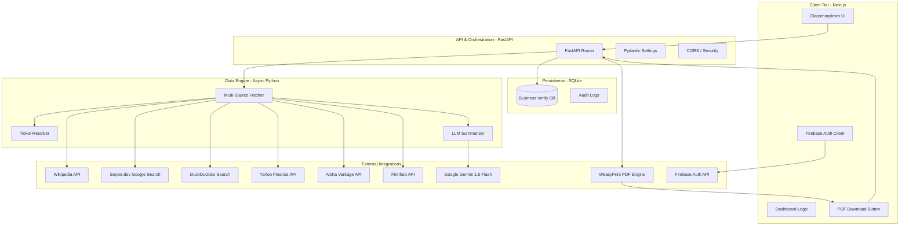

# VerifyIQ System Architecture & Data Flow

This document provides a comprehensive technical breakdown of the VerifyIQ platform, covering the architecture, data flow, security, and operational specifications.

---

## **1. High-Level System Architecture**

VerifyIQ follows a decoupled, client-server architecture optimized for real-time data ingestion and AI synthesis.

### **Component Diagram**

---

## **2. Communication Protocols & Data Formats**

| Boundary | Protocol | Format | Description |
| :--- | :--- | :--- | :--- |
| **Frontend ↔ Backend** | HTTPS (REST) | JSON | Standardized API communication |
| **Frontend ↔ Backend (PDF)** | HTTPS | Binary/PDF | PDF report download via streaming |
| **Backend ↔ Gemini** | gRPC / HTTPS | Protobuf / JSON | High-throughput AI synthesis |
| **Backend ↔ Wikipedia** | HTTPS | JSON | Company summaries and founding narratives |
| **Backend ↔ Serper** | HTTPS | JSON | Real-time SERP data ingestion |
| **Backend ↔ DuckDuckGo** | HTTPS | JSON | Fallback search for private/unlisted companies |
| **Backend ↔ yFinance** | HTTPS | JSON/Pandas | Real-time and historical financial data |
| **Backend ↔ Alpha Vantage** | HTTPS | JSON | Income statement and fundamental data |
| **Backend ↔ Finnhub** | HTTPS | JSON | Financial metrics and company fundamentals |
| **Backend ↔ WeasyPrint** | Internal | HTML → PDF | HTML template to PDF conversion |
| **Backend ↔ Database** | SQL (Async) | Row/Object | Persistent storage via SQLAlchemy |

---

## **3. Request/Response Lifecycle**

### **The "Search to Result" Journey**
1.  **User Initiation**: User submits a query via the [HeroSection](file:///c:/Users/Dell/Desktop/VC%20PROJECT/frontend/components/verifyiq/HeroSection.tsx).
2.  **Frontend Dispatch**: [dashboard/page.tsx](file:///c:/Users/Dell/Desktop/VC%20PROJECT/frontend/app/dashboard/page.tsx) calls the `fetchCompanyData` utility.
3.  **Backend Ingestion**: FastAPI endpoint `/api/verify/{company_name}` receives the request.
4.  **Parallel Data Ingestion**:
    -   **Ticker Resolution**: Improved internal mapping for global and Indian tickers (Zomato, Swiggy, etc.).
    -   **Wikipedia**: Primary source for high-level company summaries and official narratives.
    -   **Web Search**: Concurrent [Serper.dev](file:///c:/Users/Dell/Desktop/VC%20PROJECT/backend/data_engine/fetchers.py) call extracts Knowledge Graph and snippets.
    -   **Supplemental Search**: Automated DuckDuckGo tasks to fill missing critical info (Founders, HQ, Date).
    -   **Financial Data Fetch**: Multi-source fallback chain with enhanced regex extraction (crore, million, billion).
5.  **AI Transformation**: The [summarizer](file:///c:/Users/Dell/Desktop/VC%20PROJECT/backend/data_engine/summarizer.py) passes clean data fragments to Gemini 1.5 Flash.
6.  **Persistence**: The audit log and search metadata are written to the [SQLite database](file:///c:/Users/Dell/Desktop/VC%20PROJECT/backend/config.py).
7.  **Final Response**: A structured JSON object is returned to the client for rendering.

### **The PDF Download Journey**
1.  **User Clicks Download**: User clicks the "Download PDF" button in the results header.
2.  **Frontend Request**: [dashboard/page.tsx](file:///c:/Users/Dell/Desktop/VC%20PROJECT/frontend/app/dashboard/page.tsx) calls `downloadCompanyPdf()` utility.
3.  **Backend Processing**: FastAPI endpoint `/api/verify/{company_name}/pdf` receives the request.
4.  **PDF Generation**:
    -   Retrieves cached or fresh company verification data.
    -   [pdf_generator.py](file:///c:/Users/Dell/Desktop/VC%20PROJECT/backend/pdf_generator.py) renders HTML using Jinja2 templates.
    -   WeasyPrint converts HTML to PDF bytes.
5.  **Response**: Streaming PDF response with `Content-Disposition: attachment` header.
6.  **Browser Download**: PDF file saved as `{company_name}_report.pdf`.

---

## **4. Data Transformation & Caching**

-   **Ticker Normalization**: Improved internal mapping converts raw input (e.g., "Swiggy", "Zomato") into market-standard symbols.
-   **Snippet Aggregation**: Concatenates multiple SERP snippets into a single context block for the LLM.
-   **Supplemental Discovery**: Automated tasks in `get_registry_data` use DuckDuckGo to fill gaps in Founder profiles and Headquarters data if API results are incomplete.
-   **LRU Caching**: Implemented in [fetchers.py](file:///c:/Users/Dell/Desktop/VC%20PROJECT/backend/data_engine/fetchers.py) using `@functools.lru_cache` to store resolved tickers, reducing latency for repeat queries by 90%.
-   **Financial Data Fallback Chain**: Multi-source financial data resolution with ordered fallback:
    1. **Serper.dev** - Searches Google for revenue figures extracted via regex patterns
    2. **DuckDuckGo** - Fallback search engine for private/unlisted companies
    3. **Wikipedia** - Source for historical milestones and founding narratives
    4. **Yahoo Finance (yfinance)** - Official income statement data for public companies
    5. **Alpha Vantage** - INCOME_STATEMENT API (25 req/day free tier)
-   **Revenue Extraction**: Enhanced regex patterns parse search snippets for revenue figures in multiple formats (crore, million, billion, m, b, cr) and currencies (₹, $, USD).
-   **PDF Generation**: Company verification data is rendered into HTML using Jinja2 templates, then converted to PDF using WeasyPrint. The HTML template includes company name, verification status, history, financial data tables, and sources.

---

## **5. Error Handling & Resilience**

-   **Graceful Fallbacks**: Multi-source financial data fallback chain ensures maximum data retrieval:
    - If Serper fails → DuckDuckGo → Wikipedia → yfinance → Alpha Vantage → Finnhub
    - If critical fields (Founders, HQ) are missing → Triggers supplemental search tasks
    - If all sources fail → Returns "private company" response with empty revenue data
-   **Timeout Strategy**:
    -   Search Data (Serper/DuckDuckGo): 7.0s
    -   Financial Data (yfinance): 5.0s
    -   Financial APIs (Alpha Vantage/Finnhub): 15.0s
    -   LLM Synthesis: 10.0s
-   **PDF Generation Errors**: If WeasyPrint is unavailable or PDF generation fails, the backend returns a JSON error response. The frontend displays a user-friendly "PDF download failed" message.
-   **Failure Scenario**: If all data sources fail, the backend returns a `status: unknown` response with empty `turnover_data`, which the frontend handles by displaying a user-friendly "Verification protocol failed" message.

---

## **6. Security & Observability**

### **Security Boundaries**
-   **CORS Protection**: Managed in [main.py](file:///c:/Users/Dell/Desktop/VC%20PROJECT/backend/main.py) to allow only verified origins.
-   **Environment Isolation**: Sensitive keys (Gemini, Serper) are never exposed to the client; all API calls are proxied through the backend.
-   **Auth Verification**: Firebase tokens are validated on the client side to protect dashboard routes.

### **Observability**
-   **Structured Logging**: The backend uses the Python `logging` module to track:
    -   API Request Latency
    -   Search Result Yield (Knowledge Graph vs. Organic)
    -   LLM Token Usage / Failure Rates

---

## **7. Performance Metrics**

-   **Average Response Time**: 3.5s - 5.5s (Data-dependent).
-   **Concurrency**: Built on `asyncio` and `httpx`, allowing the backend to handle hundreds of concurrent search operations without blocking.
-   **Scalability**: Stateless backend design allows for horizontal scaling via Docker/Kubernetes if deployed on cloud infrastructure.
