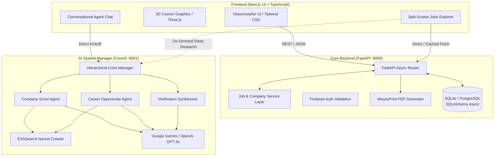

# 🌟 VerifyIQ — AI-Powered Corporate Intelligence & Career Platform
### *Multi-Agent Verification, Live Career Discovery & Student Insights*

[](https://nextjs.org/)
[](https://fastapi.tiangolo.com/)
[](https://crewai.com/)
[](https://www.python.org/)
[](https://www.typescriptlang.org/)
[](https://tailwindcss.com/)
[](https://opensource.org/licenses/MIT)

---

## 📌 Table of Contents
- [Overview](#-overview)
- [Key Features](#-key-features)
- [System Architecture](#-system-architecture)
- [Tech Stack](#-tech-stack)
- [Directory Structure](#-directory-structure)
- [Getting Started](#-getting-started)
  - [Prerequisites](#prerequisites)
  - [1. Backend Setup (FastAPI)](#1-backend-setup-fastapi)
  - [2. AI System Manager Setup (CrewAI Microservice)](#2-ai-system-manager-setup-crewai-microservice)
  - [3. Frontend Setup (Next.js)](#3-frontend-setup-nextjs)
- [Environment Variables](#-environment-variables)
- [API Endpoints](#-api-endpoints)
- [Contributing & License](#-contributing--license)

---

## 🚀 Overview

**VerifyIQ** (also known as **Student Hub / Business Verifier**) is an end-to-end full-stack corporate intelligence and career discovery ecosystem designed to eliminate misinformation and unverified claims across traditional job boards.

By combining real-time multi-source data resolution with an autonomous **CrewAI multi-agent AI framework**, VerifyIQ crawls verified company registries, official career portals, and financial databases to provide:
1. **Multi-Source Company Verification** — Synthesizing public and private company histories, founders, turnover, and corporate status into structured dossiers.
2. **Student Trust Scoring (0–100)** — An algorithmic metric evaluating official-source transparency, employee sentiment, social media presence, and legitimate hiring volume.
3. **Live, Un-Hallucinated Opportunity Discovery** — Direct-from-source internship and job discovery powered by autonomous web search agents without outdated aggregator scraping.
4. **Natural-Language Multi-Agent Chat** — An conversational interface orchestrating specialized AI research agents in real time.

---

## ✨ Key Features

### 🔍 1. Autonomous Multi-Agent AI Research (CrewAI)
* **Hierarchical Crew Orchestration:** Specialized agents (Scouts, Financial Analysts, Requirement Synthesizers) collaborate under a manager agent to process complex career queries.
* **Live Neural Web Search:** Integrated with **EXASearch** and **Google Gemini 1.5/2.0 Flash / OpenAI GPT-4o** to extract verified requirements, stipends, and direct application links with **zero mock fallback data**.

### 💼 2. Responsive Split-Screen Jobs Portal
* **Left Pane (30%):** Interactive stream of live job postings, displaying company branding, position titles, concise summaries, and bookmarking actions.
* **Right Pane (70%):** In-depth A-to-Z breakdown featuring job descriptions, verified requirements, perks & benefits, and direct apply actions wrapped in a translucent glassmorphic container.
* **Full Mobile Responsiveness:** Mobile-first overlay drawers and back-navigation allowing seamless browsing on any viewport.

### 📊 3. Student Trust Score & Financial Insights
* Multidimensional rating computed from regulatory filings, social footprints, and student reviews.
* Interactive financial visualization powered by **Recharts** displaying historical revenue turnover.

### 🎨 4. Immersive Glassmorphism UI & 3D Visuals
* High-contrast typography featuring *Instrument Serif* and *Geist Sans*.
* Interactive 3D graphics rendered with **Three.js / React Three Fiber (`@react-three/fiber`)** and `@react-three/drei`.
* Smooth scrolling powered by **Lenis** and GPU-accelerated motion transitions with **Framer Motion**.

### 📄 5. Dynamic Corporate PDF Reports
* Generates downloadable verification reports via **WeasyPrint** and **Jinja2** HTML templates.

---

## 🏗️ System Architecture



---

## 🛠️ Tech Stack

### **Frontend**
* **Framework:** Next.js 14 (App Router, Server Components & SSR)
* **Language:** TypeScript 5
* **Styling:** Tailwind CSS, PostCSS, Glassmorphism design system
* **Animations:** Framer Motion, Anime.js
* **3D Visuals:** Three.js, React Three Fiber (`@react-three/fiber`), `@react-three/drei`
* **Data Visualization:** Recharts
* **Icons & Typography:** Lucide React, Instrument Serif & Geist Fonts
* **Auth & Client:** Firebase Authentication, Axios (with retry & error classification)

### **Backend**
* **Framework:** FastAPI (Python 3.13)
* **Server:** Uvicorn (ASGI)
* **Validation & Schemas:** Pydantic v2 & Pydantic-Settings
* **Database & ORM:** SQLAlchemy 2.0 (Async), `aiosqlite` (Dev) / `asyncpg` (Production PostgreSQL)
* **PDF Generation:** WeasyPrint, Jinja2
* **HTTP Clients:** HTTPX (Async), aiohttp

### **AI & Data Pipeline**
* **Agentic Framework:** CrewAI 1.14+
* **LLM Providers:** Google Gemini (2.0 / 1.5 Flash), OpenAI (GPT-4o-mini), LiteLLM
* **Search & Crawling:** EXASearch API, DuckDuckGo Search, Wikipedia API, Yahoo Finance (`yfinance`), BeautifulSoup4

---

## 📁 Directory Structure

```text
VC PROJECT/
├── backend/                         # FastAPI core backend service (:8000)
│   ├── agents/                      # Conversational agent coordinators
│   ├── data_engine/                 # Company data fetchers & financial parsers
│   ├── routers/                     # Endpoint controllers (students, companies)
│   ├── services/                    # Business logic (job_service, verifier)
│   ├── templates/                   # Jinja2 HTML templates for PDF reports
│   ├── config.py                    # Environment & application settings
│   ├── database.py                  # Async SQLAlchemy session engine
│   ├── db_models.py                 # Database schemas & models
│   ├── main.py                      # FastAPI entrypoint
│   └── requirements.txt             # Backend dependencies
│
├── ai_system_manager_service/       # Standalone CrewAI microservice (:8001)
│   ├── config/                      # Agent & Task definitions (YAML)
│   │   ├── agents.yaml              # Roles, goals, and backstories
│   │   └── tasks.yaml               # Task workflows and expected outputs
│   ├── src/ai_system_manager/       # Crew definition & tool bindings
│   │   └── crew.py                  # CrewBase setup with Gemini/OpenAI fallbacks
│   ├── app.py                       # FastAPI wrapper exposing /kickoff
│   └── pyproject.toml               # uv / pip package configuration
│
├── frontend/                        # Next.js 14 frontend application (:3000)
│   ├── app/                         # App Router pages & layouts
│   │   ├── company/[id]/            # Verified company breakdown & tabs
│   │   ├── dashboard/               # Interactive student dashboard
│   │   ├── explore/                 # Opportunity discovery grid
│   │   ├── jobs/                    # Split-screen job search interface
│   │   ├── layout.tsx               # Root layout with Auth & Theme Providers
│   │   └── page.tsx                 # Hero landing page & conversational AI chat
│   ├── components/                  # Reusable UI component library
│   │   ├── cosmic/                  # 3D Three.js canvas & visuals
│   │   ├── layout/                  # Navigation, animated headers, cursor
│   │   └── verifyiq/                # Glassmorphic cards, trust scores
│   ├── lib/                         # API clients, Firebase config & utilities
│   ├── types/                       # TypeScript interfaces & API envelopes
│   └── tailwind.config.ts           # Design tokens & extended theme
│
├── PRESENTATION_DETAILED.md         # Full architectural presentation & Q&A
├── PROJECT_SUMMARY.md               # Monorepo technical documentation
└── README.md                        # Master project documentation
```

---

## ⚡ Getting Started

### Prerequisites
* **Node.js:** v18.17+ or v20+
* **Python:** v3.10 to v3.13
* **Package Managers:** `npm` (Frontend) and `pip` or `uv` (Backend)

---

### 1. Backend Setup (FastAPI)

1. Navigate to the backend directory:
   ```bash
   cd backend
   ```
2. Create and activate a Python virtual environment:
   ```bash
   # Windows (PowerShell):
   python -m venv .venv
   .\.venv\Scripts\Activate.ps1

   # Linux / macOS:
   python3 -m venv .venv
   source .venv/bin/activate
   ```
3. Install dependencies:
   ```bash
   pip install -r requirements.txt
   ```
4. Configure your `.env` file (refer to [Environment Variables](#-environment-variables)).
5. Start the backend server on **port 8000**:
   ```bash
   python -m uvicorn main:app --host 127.0.0.1 --port 8000 --reload
   ```
   *Swagger API Documentation will be available at:* `http://localhost:8000/docs`

---

### 2. AI System Manager Setup (CrewAI Microservice)

1. Open a second terminal and navigate to the CrewAI microservice:
   ```bash
   cd ai_system_manager_service
   ```
2. Create and activate a virtual environment:
   ```bash
   python -m venv .venv
   .\.venv\Scripts\Activate.ps1  # or source .venv/bin/activate
   ```
3. Install dependencies:
   ```bash
   pip install -e .
   ```
4. Start the AI microservice on **port 8001**:
   ```bash
   python -m uvicorn app:app --host 127.0.0.1 --port 8001 --reload
   ```
   *Microservice health check will be available at:* `http://localhost:8001/health`

---

### 3. Frontend Setup (Next.js)

1. Open a third terminal and navigate to the frontend directory:
   ```bash
   cd frontend
   ```
2. Install npm dependencies:
   ```bash
   npm install
   ```
3. Start the Next.js development server on **port 3000**:
   ```bash
   npm run dev
   ```
4. Open your browser and navigate to:
   ```text
   http://localhost:3000
   ```

---

## 🔑 Environment Variables

### Backend (`backend/.env`)
```env
DATABASE_URL="sqlite+aiosqlite:///./business_verify.db"
GEMINI_API_KEY="your_google_gemini_api_key"
OPENAI_API_KEY="your_openai_api_key"          # Optional fallback
EXA_API_KEY="your_exa_ai_api_key"             # Required for neural search
SERPER_API_KEY="your_serper_api_key"          # Optional search fallback
```

### AI Microservice (`ai_system_manager_service/.env`)
```env
GEMINI_API_KEY="your_google_gemini_api_key"
OPENAI_API_KEY="your_openai_api_key"
EXA_API_KEY="your_exa_ai_api_key"
```

### Frontend (`frontend/.env.local`)
```env
NEXT_PUBLIC_API_URL="http://localhost:8000"
NEXT_PUBLIC_CREWAI_API_URL="http://localhost:8001"
```

---

## 📡 API Endpoints

| Method | Endpoint | Description |
|---|---|---|
| `GET` | `/api/v1/companies/verify/{name}` | Perform multi-source verification and fetch trust metrics |
| `GET` | `/api/v1/companies/{name}/pdf` | Generate and download a corporate verification PDF report |
| `GET` | `/api/v1/students/opportunities` | Retrieve verified jobs and internships with filtering |
| `POST` | `/api/v1/students/parse-jobs` | Parse raw AI agent markdown reports into structured JSON schemas |
| `POST` | `/api/v1/students/favorites` | Bookmark a company to student favorites |
| `POST` | `/api/v1/students/reviews` | Submit peer student review and rating |
| `POST` | `http://localhost:8001/kickoff` | Trigger CrewAI multi-agent live research workflow |

---

## 🤝 Contributing & License

Contributions, issues, and feature requests are welcome! Feel free to check the [issues page](https://github.com/Nischal0258/Business-Verifier/issues).

Distributed under the **MIT License**. See `LICENSE` for more information.
